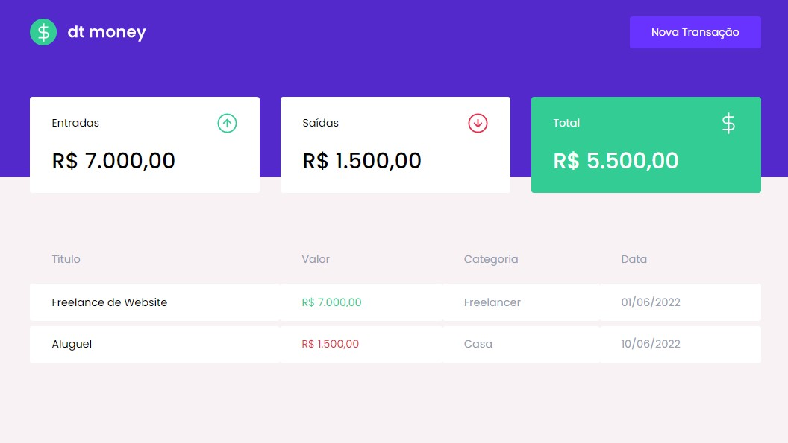
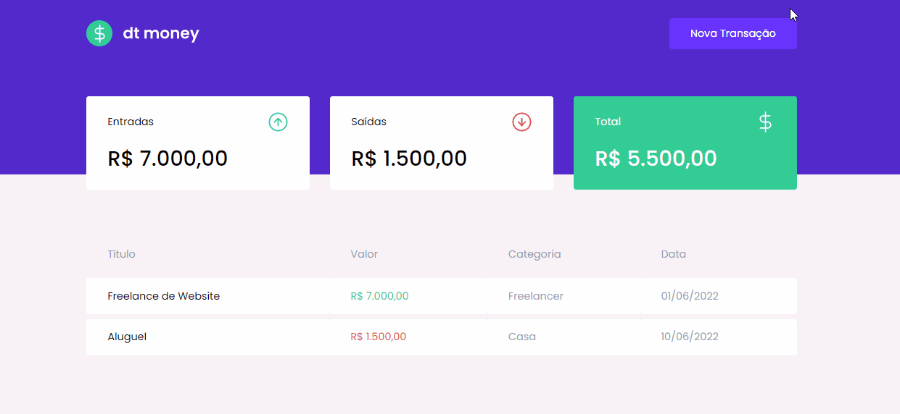
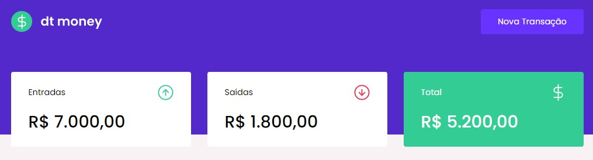
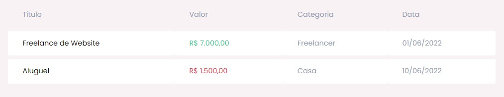

# DT MONEY

 

This is an application to manage your personal finances. It was built during the Chapter II of the React JS course from [Rocketseat](https://www.rocketseat.com.br/) with the goal of to learn about importants tools of React JS.

## Sumary

- [Overview]()
- [Features](#features)
  - [New transaction](#New_Transaction)
  - [Summary](#Summary)
  - [Transaction table](#Transaction_table)
- [Technologies](#Technologies)
- [Author](#author)

## Features

### New transaction

The transactions are inserted through a modal.

### Summary

A little dashboard with the sum of all transactions by type and total.

### Transaction table

All the transactions stay in the transaction table.

## Technologies

- React JS
- Typescript
- Styled components
- Mirage JS
- Context API
- Hooks
- Axios

## Author

- [Github profile](https://github.com/mauricio-tejada)
- [Linkedin](https://www.linkedin.com/in/mauricio-tfernandes/)

